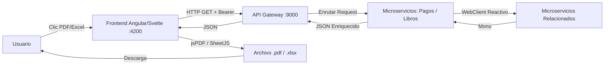

# 3 · Arquitectura General

## 3.1 Stack Tecnológico del Proyecto (FIDEI NEXUS)

- **Backend:** Ecosistema de microservicios desarrollados en **Spring Boot 3.x / Java 21**, utilizando programación reactiva no bloqueante con **Spring WebFlux**.
- **Gateway:** `vg-ms-gateway` — Único punto de entrada perimetral que gestiona el enrutamiento hacia los servicios internos.
- **Persistencia:** Bases de datos relacionales PostgreSQL alojadas en la nube (Neon Tech), consumidas mediante el driver reactivo **R2DBC**.
- **Seguridad:** Spring Security con OAuth2 Resource Server. Los tokens JWT (Bearer) delegados a **Keycloak** se almacenan y propagan en cada request.
- **Frontend:** Aplicación SPA (`Angular` / `Svelte`) estructurada con componentes standalone y Tailwind CSS.
- **Despliegue:** Contenedores auto-gestionados en Render / VPS mediante flujos de integración.

## 3.2 Arquitectura de Reportes (100% Client-Side)

Al igual que otros módulos modernos del sistema, FIDEI NEXUS no implementa generación de documentos en el backend. Los microservicios (`vg-ms-paymentService`, `vg-ms-booksService`) actúan como productores de datos JSON puros enriquecidos. El frontend asume toda la responsabilidad de renderizar estos payloads en documentos descargables utilizando `jsPDF` y `SheetJS`.

## 3.3 Microservicios y Matriz de Puertos Internos

Para evitar colisiones en el desarrollo local y estandarizar el despliegue, el ecosistema define puertos específicos. El **Equipo 3** es responsable de los dominios transaccionales y de catálogo:

| Microservicio | Puerto Interno | Base de Datos | Responsabilidad Principal |
|---------------|---------------|---------------|---------------------------|
| `prs-eureka-server` | `8761` | — | Discovery Server y registro de servicios. |
| `vg-ms-gateway` | `9000` | — | API Gateway, enrutamiento único y filtro JWT. |
| `vg-ms-auth` | `9001` | PostgreSQL | Identity Provider y delegación a Keycloak. |
| **`vg-ms-booksService`**| **`8081`** | **PostgreSQL (Neon)** | **Catálogo, inventario y control de stock de libros.** |
| **`vg-ms-paymentService`**| **`8082`** | **PostgreSQL (Neon)** | **Motor transaccional de ingresos y recibos de pago.** |
| `vg-ms-peopleService` | `8083` | PostgreSQL | Datos demográficos y perfiles de personas. |
| `vg-ms-requestsService`| `8084` | PostgreSQL | Ciclo de vida de solicitudes en el sistema. |

